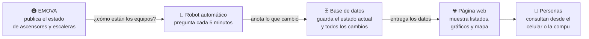
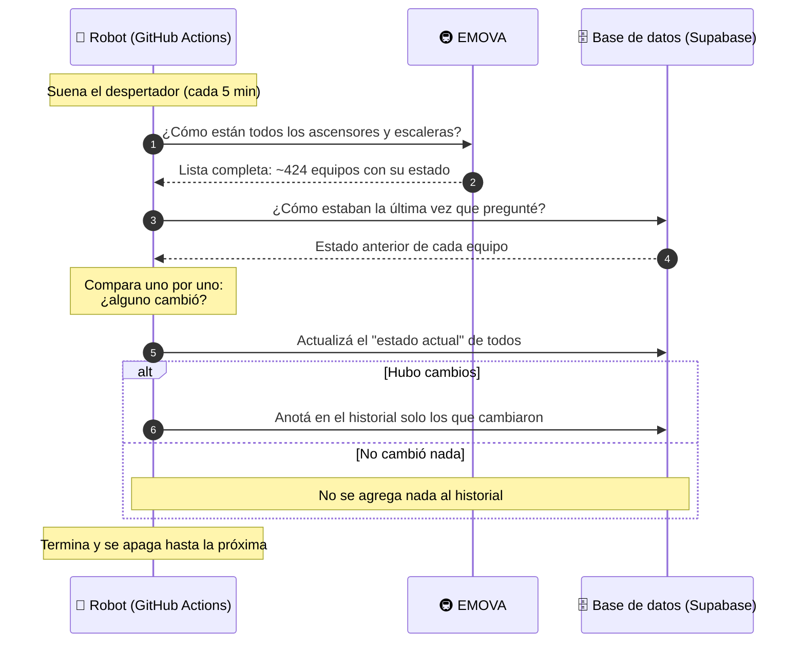
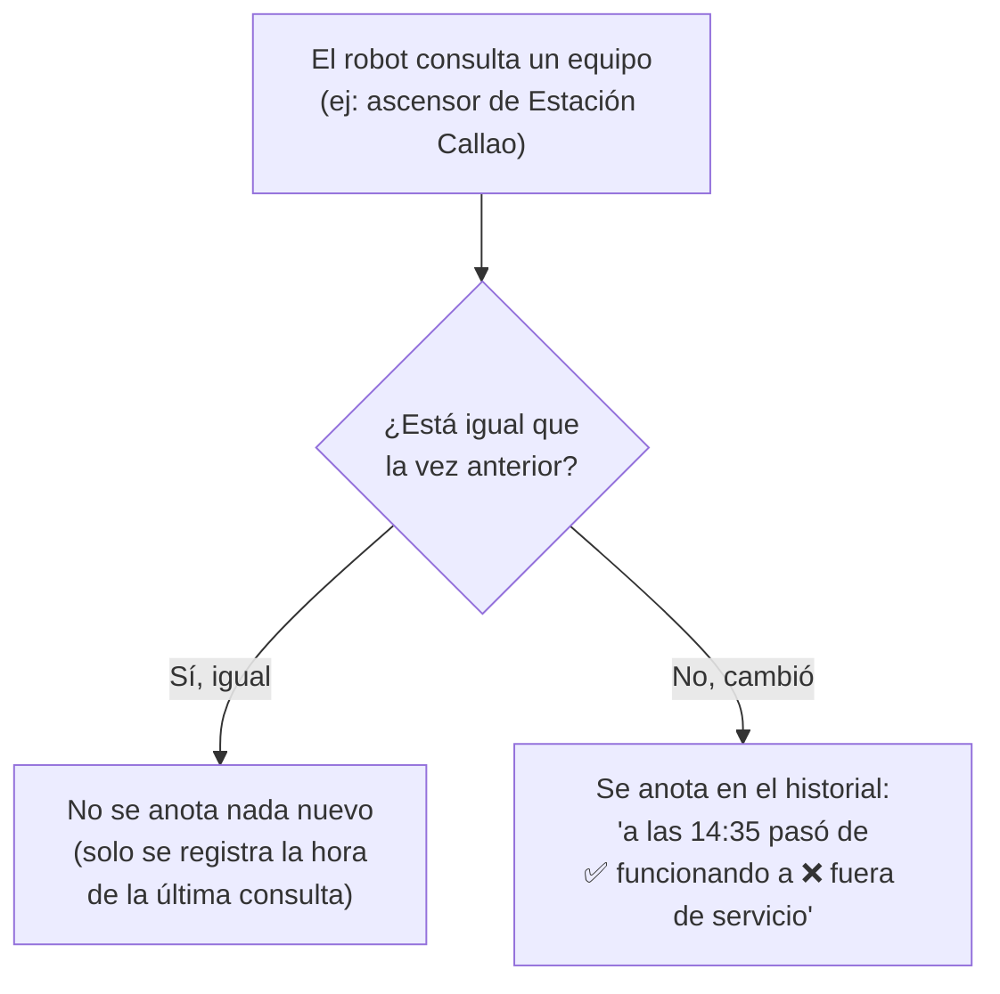
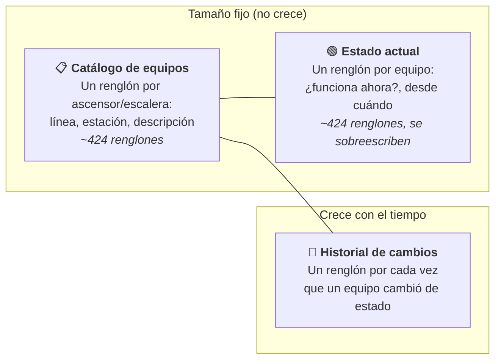
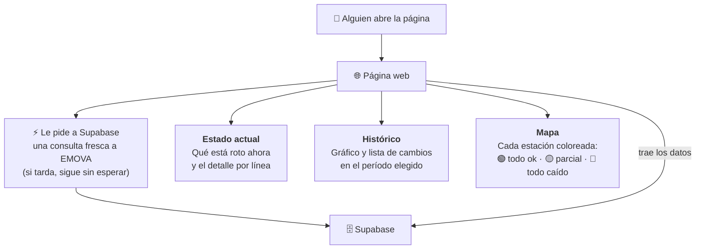
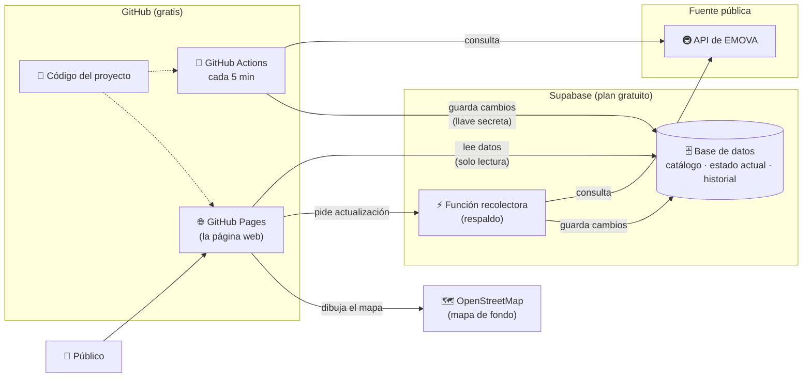

# Accesibilidad del Subte: cómo funciona (explicado sin tecnicismos)

Este documento cuenta **qué hace el proyecto, de dónde salen los datos, dónde
se guardan y cómo llegan a la página que ve la gente**. Está pensado para
presentar el proyecto a cualquier persona, sin necesidad de saber programar.
Si buscás los detalles técnicos (instalación, configuración), están en
[`README.md`](README.md).

---

## 1. ¿Qué problema resuelve?

Para una persona en silla de ruedas, con movilidad reducida, con un cochecito
o con valijas, que un **ascensor o una escalera mecánica** del subte funcione
o no cambia por completo el viaje.

EMOVA (la empresa que opera el subte de Buenos Aires) publica en internet el
estado de esos equipos **en ese momento**, pero:

- **no guarda memoria**: no se puede saber cuántas veces se rompió un
  ascensor el mes pasado ni cuánto tiempo estuvo fuera de servicio;
- **no es fácil de mirar**: son datos pensados para computadoras, no para
  personas.

Este proyecto **consulta esa información cada 5 minutos, la guarda y arma un
historial**, y la muestra en una página web con listados, gráficos y un mapa.

---

## 2. La idea en una imagen

Son cuatro piezas:

| Pieza | Qué es, en criollo | Servicio que se usa | ¿Cuesta plata? |
|---|---|---|---|
| **Fuente de datos** | La "ventanilla" pública donde EMOVA informa el estado de cada ascensor y escalera | API pública de EMOVA / Metrovías | No |
| **Robot recolector** | Un programa que se despierta solo cada 5 minutos, pregunta y anota | GitHub Actions (y una función de Supabase) | No |
| **Base de datos** | La "libreta" donde queda todo guardado | Supabase | No (plan gratuito) |
| **Página web** | El tablero que ve la gente | GitHub Pages + OpenStreetMap para el mapa | No |

**Todo el proyecto funciona con servicios gratuitos** y no necesita que haya
ninguna computadora personal prendida.

---

## 3. Los servicios, uno por uno

### 🚇 EMOVA (la fuente)

EMOVA tiene una dirección web pública que, cuando se le pregunta, responde con
la lista completa de **líneas → estaciones → accesos** (ascensores y escaleras
mecánicas), y para cada acceso dice si **funciona o no**. Hoy son **unos 424
equipos** en toda la red (líneas A, B, C, D, E y H).

No hace falta usuario ni contraseña: es información pública.

### 🤖 GitHub Actions (el robot con despertador)

GitHub es el sitio donde vive el código del proyecto. Además de guardar el
código, ofrece **GitHub Actions**: computadoras en la nube que ejecutan
tareas de forma automática según un horario.

Acá se le dijo: *"cada 5 minutos, ejecutá el programa que consulta a EMOVA y
guarda los resultados"*. GitHub presta una computadora por unos segundos, la
tarea corre y la computadora se apaga. Como el repositorio es público, esto
no tiene costo.

Como respaldo, la base de datos (Supabase) también tiene su propia función
recolectora que hace lo mismo y que la página web "despierta" cada vez que
alguien entra, para mostrar datos lo más frescos posible.

### 🗄️ Supabase (la libreta)

Supabase es un servicio de **base de datos en la nube**. Es el lugar donde se
guarda todo de forma ordenada. Tiene dos ventajas importantes para este
proyecto:

- el **plan gratuito** alcanza (hasta 500 MB);
- permite que cualquiera **lea** los datos desde internet, pero solo el robot
  (que tiene una llave secreta) puede **escribir**. Así nadie puede alterar
  la información.

### 🌐 GitHub Pages + OpenStreetMap (la vidriera)

La página web es un único archivo que GitHub publica gratis (**GitHub
Pages**). Cuando alguien la abre, la página le pide los datos directamente a
Supabase y los dibuja. El mapa de fondo viene de **OpenStreetMap**, un mapa
mundial libre y colaborativo.

---

## 4. ¿Qué pasa cada 5 minutos?

Todo el ciclo tarda unos pocos segundos.

---

## 5. La idea clave: anotar solo los cambios

Una forma ingenua sería guardar una "foto" completa de los 424 equipos cada
5 minutos. Eso son más de **120.000 anotaciones por día**, casi todas
repetidas ("sigue funcionando", "sigue funcionando"…). El espacio gratuito se
llenaría en pocos días.

En cambio, el proyecto hace lo que haría una persona prolija con una
libreta: **solo escribe cuando algo cambia**.

Con este método, según las mediciones hechas, el espacio gratuito alcanza para
**aproximadamente 20 meses** de historial. Y cuando se acerque al límite, se
pueden archivar los datos viejos en un archivo aparte.

---

## 6. Cómo está organizada la información

La base de datos tiene tres "planillas" (tablas):

- **Catálogo de equipos**: la lista de todos los ascensores y escaleras, con
  su nombre y ubicación. Se escribe una sola vez.
- **Estado actual**: cómo está cada equipo *ahora mismo*. Se pisa en cada
  consulta, así que siempre ocupa lo mismo.
- **Historial de cambios**: el registro de "qué cambió y cuándo". Es la única
  planilla que crece, y es la que permite responder preguntas como *"¿cuántas
  veces falló este ascensor este mes?"*.

Para no repetir "Línea B – Estación Callao – Ascensor de andén a vestíbulo"
miles de veces, el historial solo guarda un número que apunta al catálogo
(como un número de ficha). Eso ahorra mucho espacio.

---

## 7. La página web: qué ve la gente

La página tiene tres pestañas:

1. **Estado actual**: primero, la lista de equipos que están fuera de servicio
   en este momento; debajo, todas las líneas para desplegar y ver cada equipo.
2. **Histórico**: se elige un rango de tiempo y aparece un gráfico con la
   cantidad de cambios y el detalle de qué pasó con cada equipo.
3. **Mapa**: el trazado de las líneas del subte sobre el mapa de la ciudad,
   con cada estación pintada según qué porcentaje de sus equipos funciona.

La página **no necesita un servidor propio**: le pide los datos directamente
a Supabase, que solo permite leerlos.

---

## 8. Panorama completo

---

## 9. Preguntas frecuentes

**¿Los datos son oficiales?**
Vienen de la información pública que publica EMOVA. El proyecto no los
modifica: solo los guarda y los ordena. Si EMOVA informa algo incorrecto, acá
se va a ver igual.

**¿Qué tan actualizados están?**
Se consultan cada 5 minutos y, además, cada vez que alguien abre la página se
intenta hacer una consulta en el momento.

**¿Puede alguien alterar los datos?**
No. Leer es público, pero escribir requiere una llave secreta que solo tiene
el robot recolector.

**¿Qué pasa si EMOVA se cae un rato?**
Esa consulta falla y no se anota nada; en la siguiente (5 minutos después)
se retoma normalmente. La página sigue mostrando el último estado conocido.

**¿Cuánto cuesta mantenerlo?**
Nada: GitHub y Supabase se usan dentro de sus planes gratuitos. Se estima
que el espacio gratuito alcanza para cerca de 20 meses de historial.

**¿Qué información guarda de las personas que visitan la página?**
Ninguna. El proyecto solo guarda el estado de los equipos del subte.

**¿Se pueden usar los datos para otra cosa?**
Sí. Como la lectura es pública, cualquier persona u organización puede
consultarlos para hacer sus propios análisis o informes (ver
[`README.md`](README.md), sección "Consultar los datos").

---

## 10. Glosario

| Término | Significado |
|---|---|
| **API** | Una "ventanilla" en internet donde un programa le pide datos a otro. |
| **Acceso / equipo** | Cada ascensor o escalera mecánica del subte. |
| **Base de datos** | Un lugar ordenado donde se guarda información para consultarla después. |
| **Nube** | Computadoras de otras empresas que se usan a través de internet. |
| **Cron / despertador** | Una tarea programada para ejecutarse sola en un horario fijo. |
| **Historial** | El registro de cada cambio de estado con su fecha y hora. |
| **Plan gratuito (free tier)** | El nivel de uso que un servicio ofrece sin cobrar. |
| **GitHub** | Sitio donde se guarda y comparte el código de programas. |
| **Supabase** | Servicio de base de datos en la nube. |
| **OpenStreetMap** | Mapa del mundo libre, hecho por una comunidad de voluntarios. |
