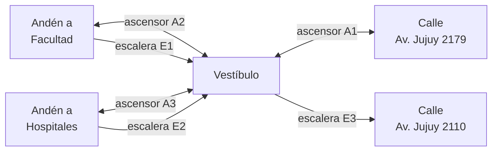

# ¿Se puede modelar cómo salir a la calle en cada estación?

**Respuesta corta: sí.** Con los datos que ya tenemos se puede armar un modelo
de la red que diga, para cada andén de cada estación, qué ascensores o
escaleras hacen falta para llegar a la calle y por qué dirección se sale. Ese
mismo modelo sirve después para calcular recorridos de una persona con
movilidad reducida a través de la red, usando solo los equipos que funcionan
en ese momento.

Ya hay una primera versión hecha para **las seis líneas** (ver "Qué está hecho"),
y se puede recorrer en la página `docs/red.html`.

*Análisis del 5 de octubre de 2026.*

---

## 1. Qué aporta cada fuente

| Fuente | Qué sirve para el modelo |
|---|---|
| **Respuesta del Poder Ejecutivo** (Res. 145/2026, PDF) | Tabla de las 296 escaleras mecánicas con su tramo ("Andén sur a hall boletería"), sentido y andén. Clasificación oficial de las 90 estaciones en categorías a) a e). Equipos parados hace años, con el motivo. **No trae tabla de ascensores.** |
| **Planilla de categorías** (Excel) | La misma clasificación a)–e) del PDF, ya pasada a planilla. |
| **Propuesta del proyecto** (Word) | No aporta datos de estaciones. |
| **API pública de EMOVA** (la que ya consultamos) | Es la fuente principal. Cada uno de los 424 equipos dice de dónde a dónde va, muchas veces con la dirección de la salida ("Vestíbulo - Av. Corrientes 1811"). Además indica el sentido y de qué lado de la estación está. |

---

## 2. Cómo es el modelo

Cada estación se describe con dos listas:

- **Lugares:** cada andén, los vestíbulos y entrepisos, cada salida a la calle
  (con su dirección) y los puntos de combinación con otras líneas.
- **Conexiones:** cada medio de elevación une dos lugares.
  - Ascensor y salvaescaleras: se usan en los dos sentidos.
  - Escalera mecánica y camino rodante: en un solo sentido.

Cada conexión lleva el código que el equipo tiene en EMOVA. Eso permite
cruzar el modelo con el estado en vivo que ya juntamos.



*Ejemplo: estación Caseros (Línea H). Si el ascensor A3 no funciona, quien
llega en el andén a Hospitales en silla de ruedas no puede salir.*

### Los andenes

El modelo trabaja **por andén y no por estación**, porque no es lo mismo:

- **Dos andenes laterales** (lo más común): uno por sentido. Cada uno puede
  tener o no su ascensor.
- **Andén central** (por ejemplo, Plaza Italia): un solo andén que sirve a los
  dos sentidos. En el modelo es un andén con dos sentidos.
- **Estaciones de un solo sentido** (Alberti y Pasco, en la Línea A): un único
  andén con un único sentido. Para ir en el otro sentido no se puede usar esa
  estación.
- **Terminales:** se usa un solo andén para llegar y para salir.

### Los perfiles de persona

El cálculo depende de qué puede usar cada persona. Por ahora hay dos perfiles:

| Perfil | Puede usar |
|---|---|
| Silla de ruedas | Ascensores, salvaescaleras y caminos rodantes |
| No puede usar escaleras fijas | Lo anterior, más escaleras mecánicas en el sentido en que andan |

Se pueden agregar otros (cochecito, valijas, etc.).

---

## 3. Dos pruebas sobre toda la red

**¿Se pueden leer automáticamente los textos de EMOVA?**
Un primer intento resolvió 343 de los 424 equipos (81%). El resto hay que
verlo a mano: textos con formato irregular o equipos cerrados por obra.

**¿Coincide con la clasificación oficial?**
Se calculó en qué estaciones se llega del andén a la calle usando solo
ascensores, y se comparó con las 37 que el Gobierno clasifica como
"accesibles de forma integral". Coinciden 32. Las diferencias son
justamente los casos que el modelo necesita captar:

- **Castro Barros y Loria:** tienen ascensor en un solo andén. Sirven para un
  sentido de viaje y no para el otro.
- **Catedral:** un ascensor es "solo ingreso" y el otro "solo hacia el
  exterior".
- **Leandro N. Alem y Pueyrredón (B y D):** son accesibles "por combinación"
  con otra línea; no tienen ascensor propio.
- **Tribunales:** figura como accesible, pero su ascensor está cerrado por
  obras.
- **Humberto 1°:** es accesible; la lectura automática no entendió sus textos.

---

## 4. Problemas encontrados

- **Los textos de EMOVA se pierden.** Cuando cierran un equipo, reemplazan la
  descripción por "Cerrada por obras" (hoy pasa en Tribunales, Lavalle y Juan
  Manuel de Rosas). Por eso el modelo guarda su propia copia del texto
  original y no depende del texto en vivo.
- **Escaleras fijas, rampas y desniveles no figuran en ninguna fuente.** Para
  silla de ruedas no cambia el resultado principal (sin ascensor no hay
  camino), pero no podemos saber si hay escalones entre un vestíbulo y su
  ascensor.
- **Los nombres de los niveles son inconsistentes.** El mismo lugar aparece
  como "vestíbulo", "hall" o "entrepiso" según el equipo. Hay que interpretar
  estación por estación.
- **Las fuentes a veces se contradicen.** En Once (Línea H) la numeración de
  las escaleras de la API y la del PDF no coinciden.
- **Las combinaciones** entre líneas están descriptas a medias; habrá que
  completarlas a mano.
- **5 estaciones no aparecen en la API** porque no tienen ningún equipo:
  Alberti, Pasco, Río de Janeiro, Scalabrini Ortiz y Plaza de los Virreyes.
  Se agregan a mano como estaciones sin acceso.

---

## 5. Qué está hecho

- **`linea_a.yaml` … `linea_h.yaml`**: el mapa de las 90 estaciones de la
  red, con sus lugares y los 424 equipos que informa EMOVA. Es un
  **borrador**: se armó leyendo los textos, sin ir a las estaciones. Tiene
  **100 dudas anotadas** para revisar y 6 equipos sin ubicar (ascensores
  cerrados por obra cuyo recorrido no figura en ninguna fuente).
- **`red.py`**: un programa que lee el mapa y dice, para cada andén y cada
  perfil, cómo salir a la calle y cómo entrar. Puede cruzarlo con el estado
  de EMOVA en el momento. Sigue el camino a través de otra línea cuando hay
  una combinación con ascensor (de Leandro N. Alem se sale por Correo Central).
- **`docs/red.html`**: una página para recorrer el mapa, con filtros por
  línea, tipo de persona y situación, y buscador por estación o calle.
  Muestra la red como está construida, sin el estado del día.

Ejemplo de lo que responde el programa:

```
Las Heras
  silla_de_ruedas
    andén a Facultad de Derecho
      salir:  ascensor A4 + ascensor A2 + ascensor A1  ·  Av. Pueyrredón 2001 (y Av. Las Heras)
```

### Resultado para toda la red (si todos los equipos funcionaran)

| Perfil | Acceso completo | Acceso parcial | Sin acceso |
|---|---|---|---|
| Silla de ruedas | 35 | 7 | 48 |
| No puede usar escaleras fijas | 36 | 24 | 30 |

"Parcial" quiere decir que se puede usar algún andén pero no todos, o que se
puede salir pero no entrar (o al revés).

De las 37 estaciones que el Gobierno clasifica como accesibles de forma
integral, en el mapa tienen acceso completo 33. Las otras cuatro son dudas
del mapa, no datos: Tribunales (ascensor cerrado, recorrido desconocido),
Pueyrredón de la D, Retiro de la E e Inclán de la H (los textos no alcanzan
para armar el camino).

### Lo que hay que revisar

Las dudas están escritas dentro de cada archivo, en la estación que
corresponde, y se ven en la página con el filtro "Con dudas a revisar". Las
más importantes:

- **Estaciones grandes con muchos niveles** (Retiro E, Correo Central,
  Santa Fe H, Diagonal Norte, Plaza Miserere): los textos no dicen qué
  niveles están unidos sin escalones.
- **Inclán (H):** según los textos, los ascensores de andén llegan a una
  boletería y el ascensor a la calle sale de la otra.
- **Terminales con andenes de llegada y de salida** (Constitución,
  Catedral): se dedujo cuál es cuál por los ascensores "solo ingreso" y
  "solo salida".
- **Alberti y Pasco:** confirmar hacia qué sentido va el único andén de
  cada una.
- **Estaciones cerradas por obra** (Tribunales, Lavalle, sector este de
  Rosas): se ubicaron las escaleras con el pedido de informes; los
  ascensores quedaron sin ubicar.
- **Once (H):** la API y el pedido de informes se contradicen en la
  numeración de las escaleras.

---

## 6. Próximos pasos

1. **Revisar el mapa** con gente que conozca las estaciones y cerrar las
   dudas.
2. **Unir las estaciones:** el viaje en tren entre estaciones vecinas y las
   combinaciones que faltan. Con eso se puede calcular un recorrido completo
   de una estación a otra.
3. **Sumar el estado en vivo a la página**, para ver a qué estaciones se
   puede llegar hoy.

---

## Cómo usarlo

```bash
pip install -r requirements.txt
python modelo/red.py                # toda la red, si todo funcionara
python modelo/red.py H --en-vivo    # una línea, con los equipos que hoy no funcionan
python modelo/red.py --json docs/red.json   # actualiza los datos de la página
```
